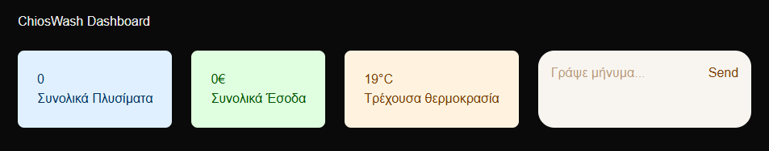

# ChiosWash AI System 🚗

A full-stack AI system for a car wash business in Chios, Greece.

## What it does
- **AI Chatbot** — handles reservations, answers questions, and provides weather forecasts using RAG
- **Dashboard** — real-time stats and revenue tracking via Next.js frontend
- **AI Agent** — monitors daily revenue and automatically sends WhatsApp alerts to the owner when needed

## Tech Stack
- **Backend:** Node.js, TypeScript, Express
- **AI:** Gemma (Google) API, RAG, Agentic workflows
- **Frontend:** Next.js, React
- **Automation:** Twilio WhatsApp, GitHub Actions CI
- **Other:** REST API, dotenv, rate limiting, error logging

## Setup & Installation

1. Clone the repository
   git clone https://github.com/tsouk88/project-A.git

2. Install dependencies
   cd backend && npm install
   cd frontend/projecta && npm install

3. Create .env file in backend/ with:
   GEMINI_API_KEY=your_key
   TWILIO_ACCOUNT_SID=your_sid
   TWILIO_AUTH_TOKEN=your_token
   TWILIO_PHONE=whatsapp:+14155238886
   OWNER_PHONE=+30xxxxxxxxxx

4. Run the backend
   cd backend && npm run dev

5. Run the frontend
   cd frontend/projecta && npm run dev

6. Open http://localhost:3000

## Live Demo
🌐 [ChiosWash Dashboard](https://project-a-taupe-kappa.vercel.app)

## Preview
